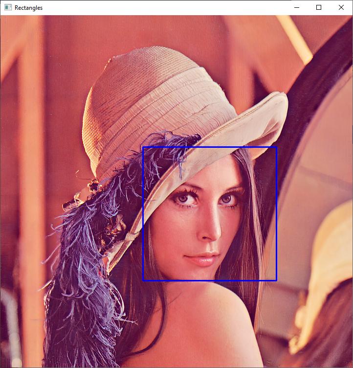
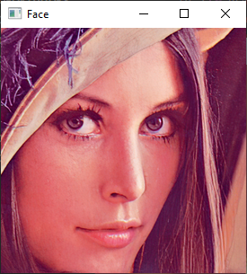
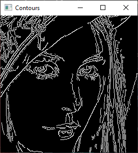
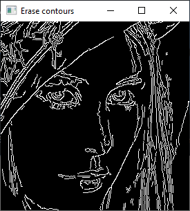
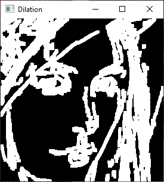
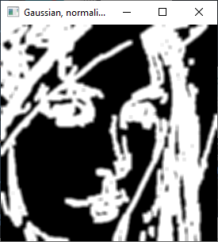
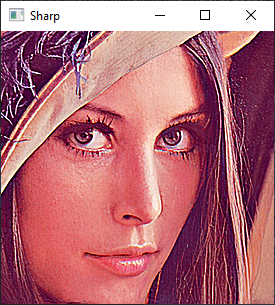
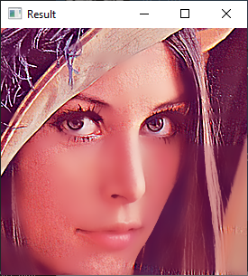
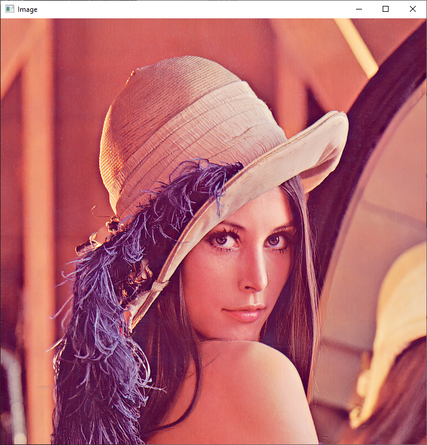

# cv-lab-1
Computer Vision Lab: image filtering (Gauss, Bilateral)

## Task

1. Find a face in the image.

 

2. We retreat 10% from the borders of the face and get this fragment of the image. Further work only with this fragment.

 

3. Get a binary image of edges (object boundaries).

 

4. Remove small borders with length and width less than 10.

 

5. Apply the operation of morphological growth (the size of the structuring element is 5 x 5).

 

6. Smoothen the resulting edge image using a 5 by 5 Gaussian filter. Get a normalized image M where all pixels have values ​​between 0 and 1.

 

7. Obtain an F1 image of the face using bilateral filtering.

 

8. Acquire an F2 face image with improved clarity/contrast.

 

9. Perform the final filtering according to the formula:

## Source image

